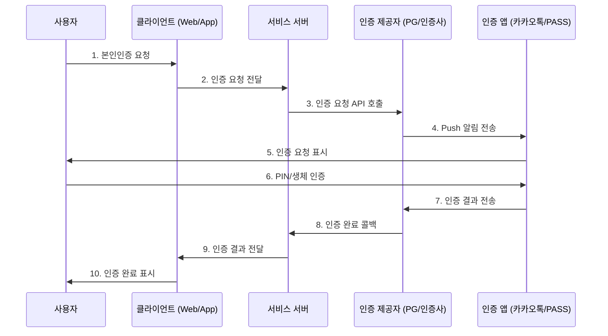
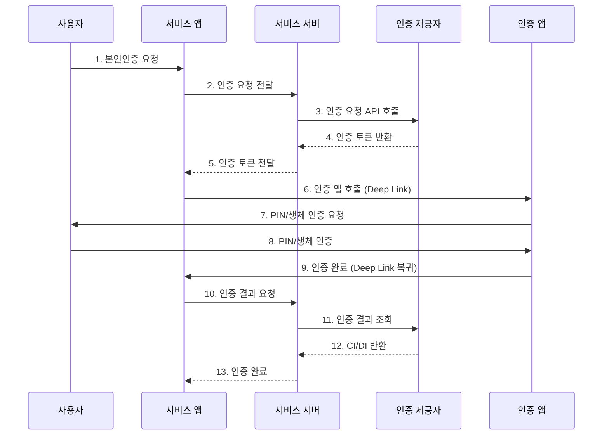
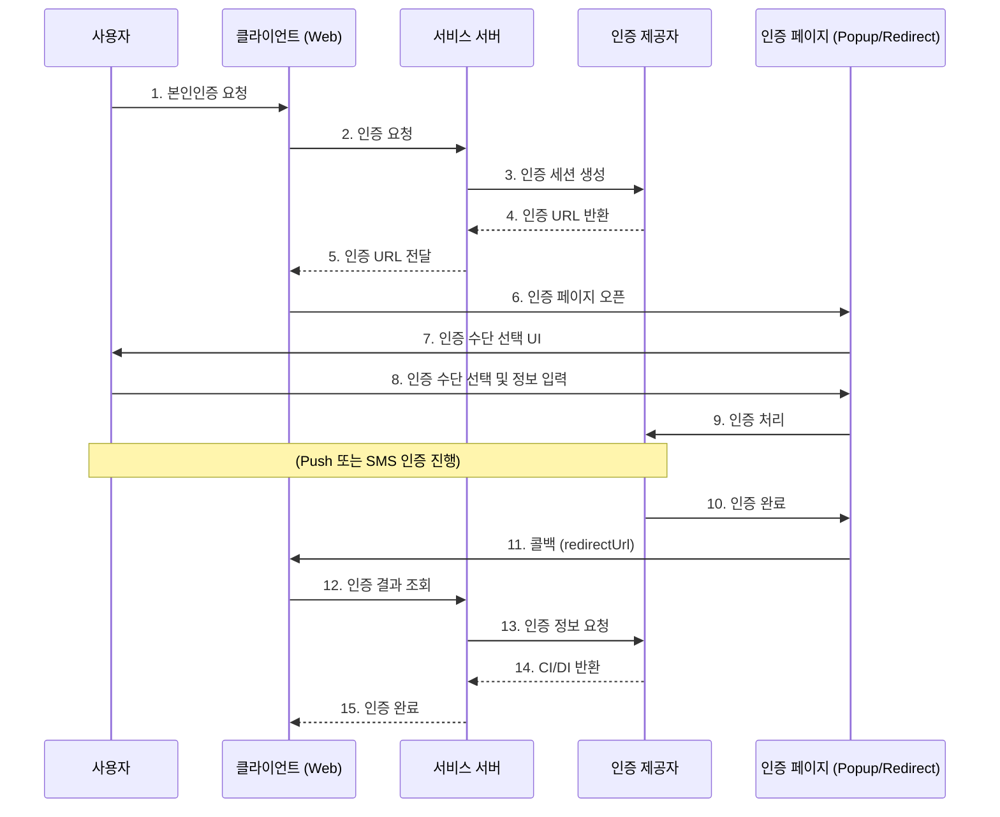

# 대한민국 간편인증 (Simple Authentication) 연구 문서

## 1. 개요 (Overview)

### 1.1 간편인증이란?

**간편인증(Simple Authentication)**은 대한민국에서 사용되는 모바일 기반 본인확인 및 전자서명 시스템이다. 2020년 전자서명법 개정 이후 기존 공인인증서의 독점적 지위가 폐지되면서, 민간 사업자들이 제공하는 다양한 인증 수단이 법적 효력을 갖게 되었다.

### 1.2 역사적 맥락

```
공인인증서 (1999~2020)
    ↓
전자서명법 개정 (2020.12.10)
    ↓
공동인증서 + 민간인증서 병존 (2020~현재)
    ↓
간편인증 활성화 (현재)
```

| 시기 | 인증 수단 | 특징 |
|------|----------|------|
| 1999~2020 | 공인인증서 | 6개 지정기관 독점 발급, ActiveX 필수 |
| 2020~ | 공동인증서 | 공인인증서 명칭 변경, 독점 지위 폐지 |
| 2020~ | 금융인증서 | 금융결제원 발급, 클라우드 저장 |
| 2017~ | 민간인증서 | 카카오, 네이버, PASS, 토스 등 |

**카카오 인증서 연혁:**

| 시기 | 이벤트 |
|------|--------|
| 2017.06 | 카카오페이 인증서 출시 (국내 최초 민간인증서) |
| 2020.12.15 | 카카오 인증서 별도 출시 |
| 2024.12.31 | 카카오페이 인증서 서비스 종료, 카카오 인증서로 일원화 |

> 출처: [SBS Biz](https://biz.sbs.co.kr/article/20000197541)

### 1.3 법적 근거

- **전자서명법** (2020.12.10 개정 시행)
- **정보통신망법** - 본인확인기관 지정
- **방송통신위원회** - 본인확인기관 감독

### 1.4 본인확인기관 유형 분류

본인확인 서비스는 4가지 대체수단 유형으로 분류됨:

| 유형 | 설명 | 대표 기관 |
|------|------|----------|
| **아이핀** | 주민번호 대체 사이버 신원확인 | 나이스평가정보, 서울평가정보, 코리아크레딧뷰로 |
| **휴대폰** | 휴대폰 기반 본인확인 | SK텔레콤, KT, LG유플러스 |
| **신용카드** | 신용카드 기반 본인확인 | 삼성카드, 신한카드, 현대카드, NH농협카드 |
| **인증서** | 전자서명 기반 본인확인 | 금융결제원, 코스콤, 한국전자인증 등 |

> 출처: [KISA 본인확인 지원포털](https://identity.kisa.or.kr/web/main/contents/M010-03)

---

## 2. 핵심 개념 (Core Concepts)

### 2.1 CI (Connecting Information) - 연계정보

**정의**: 서로 다른 서비스 간 동일인 식별을 위한 범용 식별자

| 속성 | 설명 |
|------|------|
| 크기 | 88 bytes |
| 생성 방식 | 주민등록번호 단방향 암호화 |
| 범위 | 모든 서비스에서 동일한 값 |
| 용도 | 서로 다른 서비스 간 동일인 식별 |
| 특징 | 복호화 불가, 주민번호 변경 전까지 불변 |

```
주민등록번호 ──[단방향 암호화]──> CI (88 bytes)
                                   │
                                   ├── 서비스 A: "abc123..."
                                   ├── 서비스 B: "abc123..." (동일)
                                   └── 서비스 C: "abc123..." (동일)
```

### 2.2 DI (Duplicate Information) - 중복가입확인정보

**정의**: 특정 서비스 내 동일인의 중복 가입 여부 확인을 위한 식별자

| 속성 | 설명 |
|------|------|
| 크기 | 64 bytes |
| 생성 방식 | CI + 서비스 고유정보 암호화 |
| 범위 | 서비스별로 다른 값 |
| 용도 | 동일 서비스 내 중복가입 방지 |

```
CI + 서비스A 고유값 ──[암호화]──> DI_A: "xyz789..."
CI + 서비스B 고유값 ──[암호화]──> DI_B: "def456..." (다름)
```

### 2.3 CI vs DI 비교

```
┌─────────────────────────────────────────────────────────────┐
│                      사용자 A                                │
├─────────────────────────────────────────────────────────────┤
│  CI: "abc123def456..." (모든 서비스에서 동일)                │
├─────────────────┬─────────────────┬─────────────────────────┤
│    서비스 X     │    서비스 Y     │       서비스 Z          │
│  DI: "xxx..."   │  DI: "yyy..."   │     DI: "zzz..."        │
│  (X에서만 유효) │  (Y에서만 유효) │     (Z에서만 유효)      │
└─────────────────┴─────────────────┴─────────────────────────┘
```

### 2.4 인증 유형 분류

| 유형 | 목적 | 반환 정보 | 사용 예시 |
|------|------|----------|----------|
| **본인확인** | 실명 확인 | CI, DI, 이름, 생년월일 | 회원가입, 성인인증 |
| **간편인증** | 본인 여부 확인 | 인증 성공/실패 | 로그인, ID/PW 찾기 |
| **전자서명** | 법적 효력 있는 서명 | 서명값, 서명 문서 | 계약, 동의서 |

---

## 3. 인증 흐름 (Authentication Flow)

### 3.1 Push 인증 방식

사용자의 인증 앱(카카오톡, PASS 등)으로 Push 알림을 전송하여 인증을 요청하는 방식



**특징**:
- 웹/앱 환경 모두 지원
- 사용자가 인증 앱을 별도로 확인해야 함
- 인증 완료 후 원래 서비스로 돌아와야 함

### 3.2 App-to-App 인증 방식

서비스 앱에서 인증 앱을 직접 호출하여 인증하는 방식



**특징**:
- 앱 환경에서만 사용 가능
- Push 알림 없이 직접 앱 전환
- 사용자 이탈률 감소
- 더 빠른 인증 경험

### 3.3 웹 리다이렉트 방식



---

## 4. 인증 제공자 비교 (Provider Comparison)

### 4.1 주요 인증 제공자

| 제공자 | 지원 인증서 | 연동 방식 | 특징 |
|--------|------------|----------|------|
| **PortOne** | 네이버, PASS, 토스, 카카오, 금융인증서, 삼성패스 | JavaScript SDK + REST API | 통합 결제 연동 시 유리 |
| **Barocert** | 카카오, 네이버, PASS, 토스 | REST API | 전용 인증 플랫폼, 다양한 언어 SDK |
| **KG Inicis** | 네이버, PASS, 페이코, 토스, 카카오, 금융인증서, 삼성패스, 신한, KB모바일, 카카오뱅크, 하나, 우리, 기업, 농협 등 | 웹 호출 | 가장 많은 인증서 지원 (13개+) |
| **NICE** | 휴대폰, 신용카드, 아이핀, PASS, 공동/금융인증서 | REST API | 종합 본인확인 플랫폼, 다양한 인증수단 지원 |

> 출처: [NICE API 플랫폼](https://www.niceapi.co.kr/), [NICE아이디](https://www.niceid.co.kr/), [KG이니시스 통합본인인증](https://guide.portone.io/7b7b3392-28c5-4777-b068-6bbfb70b3e89)

### 4.2 인증서별 특징

| 인증서 | 제공사 | 사용자 수 | 특징 |
|--------|--------|----------|------|
| **카카오** | 카카오 | 4,000만+ (2024.04) | 카카오톡 기반, 민간인증서 1위 ([출처](https://www.kakaocorp.com/page/detail/10998)) |
| **PASS** | SKT, KT, LGU+ | 2,800만+ (2020) | 통신사 기반, 범용성 높음 ([출처](https://namu.wiki/w/PASS)) |
| **네이버** | 네이버 | - | 네이버 앱 사용자 기반 |
| **토스** | 토스 | 2,600만 건 발급 (2024) | 앱 사용자 2,408만 (2025.03) ([출처](https://toss.im/tossfeed/article/certificate)) |
| **금융인증서** | 금융결제원 | - | 클라우드 저장, 모든 은행 |

> ※ 통계 기준 시점이 상이하며, "발급 건수"와 "활성 사용자 수"가 혼재되어 있음에 유의

### 4.3 반환 데이터 비교

| 필드 | Danal | KCP | KG Inicis |
|------|-------|-----|-----------|
| CI | O | O | O (카카오 제외) |
| DI | O | O | X |
| 이름 | O | O | O |
| 생년월일 | O | O | O |
| 성별 | O | O | O (카카오 제외) |
| 통신사 | 별도 계약 | O | X |
| 휴대폰 번호 | 별도 계약 | O | O |
| 내/외국인 | 별도 계약 | O | X (카카오/네이버 제외) |

**KG이니시스 통합인증 참고사항:**
- DI 정보를 제공하지 않음 (CI 위주 제공)
- 중복가입 확인이 필요한 경우 다른 제공자 선택 권장
- 카카오 인증 시 CI 제공을 위해 별도 서류 작성 필요
- 네이버 인증은 CI 미제공

> 출처: [PortOne - KG이니시스 통합본인인증](https://guide.portone.io/7b7b3392-28c5-4777-b068-6bbfb70b3e89)

### 4.4 비용 구조

| 서비스 | 비용 구조 |
|--------|----------|
| **다날 SMS 본인인증** | 월정액제: A형 5만원/1,200건, B형 10만원/2,400건, C형 20만원/4,800건 (초과 시 건당 45~50원) |
| **KG이니시스 통합인증** | 건당 40원 (후불 결제) |
| **PortOne 통해 가입** | KG이니시스 통합인증 무료 가입 가능 |

> 출처: [PortOne SMS본인인증 요금제](https://guide.portone.io/cfc25a28-af71-4932-9bf9-5792a1a7af7a)

### 4.5 테스트 환경 지원

| 제공자 | 테스트 환경 | 비고 |
|--------|------------|------|
| **PortOne** | ✅ 지원 | PG 계약 전 연동 개발 가능 |
| **다날 SMS 본인인증** | ❌ 미지원 | 실 계약 후 테스트 가능 (통신사 정책) |
| **KG이니시스 통합인증** | ✅ 지원 | PortOne 통해 테스트 모드 제공 |
| **Barocert** | ✅ 지원 | 개발자센터에서 무료 테스트, 운영과 동일한 환경 |

> 출처: [PortOne 결제 연동](https://portone.gitbook.io/docs/ready), [Barocert 개발자센터](https://developers.barocert.com/)

---

## 5. 의사 코드 (Pseudo Code)

### 5.1 Generic Authentication Request

```pseudo
// ==========================================
// 인증 요청 (서버 측)
// ==========================================
FUNCTION requestIdentityVerification(userInfo):
    // 1. 인증 요청 ID 생성
    verificationId = generateUniqueId()

    // 2. 인증 요청 데이터 구성
    requestData = {
        verificationId: verificationId,
        userName: userInfo.name,
        userPhone: userInfo.phone,
        userBirthDate: userInfo.birthDate,  // YYYYMMDD
        callbackUrl: config.callbackUrl,
        returnUrl: config.returnUrl,
        authMethod: "PUSH" | "APP_TO_APP"
    }

    // 3. 인증 제공자 API 호출
    response = authProvider.requestVerification(requestData)

    // 4. 인증 요청 정보 저장 (상태 추적용)
    database.save({
        verificationId: verificationId,
        status: "PENDING",
        requestedAt: currentTimestamp(),
        expiresAt: currentTimestamp() + TIMEOUT_SECONDS
    })

    // 5. 클라이언트에 반환
    RETURN {
        verificationId: verificationId,
        authUrl: response.authUrl,        // 웹 리다이렉트용
        deepLink: response.deepLink       // 앱 호출용
    }
END FUNCTION
```

### 5.2 Authentication Callback Handler

```pseudo
// ==========================================
// 인증 콜백 처리 (서버 측)
// ==========================================
FUNCTION handleVerificationCallback(callbackData):
    verificationId = callbackData.verificationId

    // 1. 인증 요청 존재 여부 확인
    verificationRecord = database.find(verificationId)
    IF verificationRecord IS NULL:
        THROW Error("Invalid verification ID")

    // 2. 만료 여부 확인
    IF verificationRecord.expiresAt < currentTimestamp():
        THROW Error("Verification expired")

    // 3. 중복 처리 방지
    IF verificationRecord.status == "VERIFIED":
        THROW Error("Already verified")

    // 4. 인증 결과 조회
    result = authProvider.getVerificationResult(verificationId)

    IF result.status == "SUCCESS":
        // 5. 인증 정보 저장
        verificationRecord.status = "VERIFIED"
        verificationRecord.ci = result.ci
        verificationRecord.di = result.di
        verificationRecord.verifiedName = result.name
        verificationRecord.verifiedBirthDate = result.birthDate
        verificationRecord.verifiedAt = currentTimestamp()

        database.update(verificationRecord)

        RETURN {
            success: true,
            ci: result.ci,
            di: result.di
        }
    ELSE:
        verificationRecord.status = "FAILED"
        verificationRecord.failureReason = result.errorMessage
        database.update(verificationRecord)

        RETURN {
            success: false,
            error: result.errorMessage
        }
END FUNCTION
```

### 5.3 CI-based User Identification

```pseudo
// ==========================================
// CI 기반 사용자 식별 (서버 측)
// ==========================================
FUNCTION findOrCreateUserByCI(verificationResult):
    ci = verificationResult.ci

    // 1. 기존 사용자 조회
    existingUser = database.users.findByCI(ci)

    IF existingUser IS NOT NULL:
        // 2a. 기존 사용자 - 정보 업데이트
        existingUser.lastVerifiedAt = currentTimestamp()
        existingUser.verifiedName = verificationResult.name
        database.users.update(existingUser)

        RETURN {
            isNewUser: false,
            user: existingUser
        }
    ELSE:
        // 2b. 신규 사용자 - 생성
        newUser = {
            ci: ci,
            di: verificationResult.di,
            name: verificationResult.name,
            birthDate: verificationResult.birthDate,
            gender: verificationResult.gender,
            phone: verificationResult.phone,
            createdAt: currentTimestamp(),
            lastVerifiedAt: currentTimestamp()
        }

        database.users.create(newUser)

        RETURN {
            isNewUser: true,
            user: newUser
        }
END FUNCTION
```

### 5.4 Duplicate Account Check

```pseudo
// ==========================================
// 중복 가입 확인 (DI 기반)
// ==========================================
FUNCTION checkDuplicateAccount(di):
    // DI로 기존 계정 조회
    existingAccounts = database.users.findAllByDI(di)

    IF existingAccounts.length > 0:
        RETURN {
            isDuplicate: true,
            existingAccountCount: existingAccounts.length,
            existingAccounts: existingAccounts.map(account => {
                id: account.id,
                maskedEmail: maskEmail(account.email),
                createdAt: account.createdAt
            })
        }
    ELSE:
        RETURN {
            isDuplicate: false
        }
END FUNCTION
```

### 5.5 Frontend Integration (Generic)

```pseudo
// ==========================================
// 프론트엔드 인증 흐름 (클라이언트 측)
// ==========================================

// 1. 인증 요청
FUNCTION initiateVerification(userInfo):
    // 서버에 인증 요청
    response = api.post("/identity/request", userInfo)

    IF response.success:
        // 환경에 따른 인증 진행
        IF isMobileApp():
            // 앱 환경: Deep Link로 인증 앱 호출
            openDeepLink(response.deepLink)
        ELSE:
            // 웹 환경: 팝업 또는 리다이렉트
            openPopup(response.authUrl)
    ELSE:
        showError(response.error)
END FUNCTION

// 2. 인증 완료 처리
FUNCTION handleVerificationComplete(verificationId):
    // 서버에서 인증 결과 조회
    result = api.get("/identity/status/" + verificationId)

    IF result.status == "VERIFIED":
        // 인증 성공 처리
        saveUserSession(result.user)
        navigateTo("/dashboard")
    ELSE IF result.status == "PENDING":
        // 아직 진행 중 - 폴링 또는 웹소켓 대기
        waitForCompletion(verificationId)
    ELSE:
        // 인증 실패
        showError(result.error)
END FUNCTION

// 3. 인증 상태 폴링
FUNCTION waitForCompletion(verificationId):
    maxRetries = 60  // 최대 60회 (3분)
    retryInterval = 3000  // 3초 간격

    FOR i = 0 TO maxRetries:
        result = api.get("/identity/status/" + verificationId)

        IF result.status != "PENDING":
            handleVerificationComplete(verificationId)
            RETURN

        wait(retryInterval)

    // 타임아웃
    showError("인증 시간이 초과되었습니다.")
END FUNCTION
```

---

## 6. 보안 고려사항 (Security Considerations)

### 6.1 필수 보안 요구사항

| 항목 | 설명 | 구현 방법 |
|------|------|----------|
| **전송 암호화** | 모든 통신 HTTPS 필수 | TLS 1.2 이상 |
| **API 키 보호** | 서버 측에서만 사용 | 환경 변수, Secret Manager |
| **CI/DI 저장** | 암호화 저장 필수 | AES-256 암호화 |
| **세션 관리** | 인증 세션 타임아웃 | 3~5분 내 만료 |
| **재사용 방지** | 인증 결과 1회만 사용 | 상태 플래그 관리 |

### 6.2 데이터 보호

```pseudo
// CI/DI 암호화 저장
FUNCTION encryptAndStoreSensitiveData(ci, di):
    encryptedCI = AES256.encrypt(ci, SECRET_KEY)
    encryptedDI = AES256.encrypt(di, SECRET_KEY)

    // 암호화된 상태로 저장
    database.save({
        ci_encrypted: encryptedCI,
        di_encrypted: encryptedDI,
        ci_hash: SHA256(ci)  // 검색용 해시
    })
END FUNCTION
```

### 6.3 Rate Limiting

```pseudo
// 인증 요청 속도 제한
FUNCTION checkRateLimit(userId, ipAddress):
    // 사용자당 제한
    userRequests = cache.get("rate:user:" + userId)
    IF userRequests > MAX_USER_REQUESTS_PER_HOUR:
        THROW Error("Too many requests")

    // IP당 제한
    ipRequests = cache.get("rate:ip:" + ipAddress)
    IF ipRequests > MAX_IP_REQUESTS_PER_HOUR:
        THROW Error("Too many requests from this IP")

    // 카운터 증가
    cache.increment("rate:user:" + userId, TTL=3600)
    cache.increment("rate:ip:" + ipAddress, TTL=3600)
END FUNCTION
```

---

## 7. 참고 자료 (References)

### 공식 문서
- [PortOne 본인인증 연동](https://developers.portone.io/opi/ko/extra/identity-verification/readme-v2)
- [Barocert 개발자 센터](https://developers.barocert.com/)
- [KG Inicis 통합인증서비스](https://sign-service.inicis.com/)
- [KISA 본인확인 지원포털](https://identity.kisa.or.kr/)

### 관련 법규
- 전자서명법 (법률 제17354호)
- 정보통신망 이용촉진 및 정보보호 등에 관한 법률

### 기술 블로그
- [본인인증 서비스 종류와 도입 방법 - PortOne](https://blog.portone.io/authorization-payment-2/)
- [개발자를 위한 본인 인증 API 연동 가이드 - Alchera](https://www.alchera.ai/resource/blog/identity-verification-API)

---

## 8. 최신 동향 (2024-2025)

### 8.1 PASS 모바일 운전면허 확인서비스 법적 효력 획득

- **시행일**: 2024년 10월 25일
- **법적 근거**: 도로교통법 제85조의2제4항 (법률 제20155호, 2024.1.30 개정)
- **효력**: 실물 운전면허증과 동일한 법적 효력
- **활용 분야**: 경찰 운전면허 확인, 주민센터, 공직선거 투표장, 국내 항공 탑승, 편의점, 영화관, 렌터카, 병의원 등
- **가입자 수**: 1,100만 명 이상 (2024년 기준)

> 출처: [SK텔레콤 뉴스룸](https://news.sktelecom.com/206005)

### 8.2 본인확인기관 지정심사 (2025년)

- **심사 기간**: 2025년 5~7월 (또는 7~8월)
- **현황**: 2025년 9월 기준 총 23개 기관 지정
- **심사 기관**: 방송통신위원회 (KISA 지원)
- **신청 경로**: KISA 본인확인 지원포털

> 출처: [KISA 본인확인 지원포털](https://identity.kisa.or.kr/)
