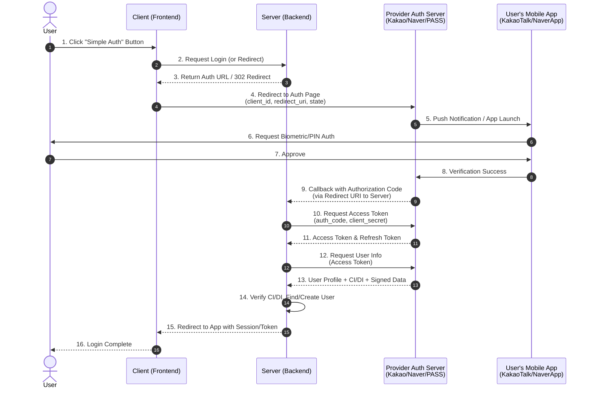

# Korean Simple Authentication Research

This document outlines the research findings on the technical implementation of "Simple Authentication" (간편인증) in Korea (e.g., Kakao, Naver, PASS, Toss).

## 1. Overview
Korean Simple Authentication is a system that allows users to verify their identity using private certificates issued by private entities (Kakao, Naver, etc.) instead of the traditional public certificates. It is legally backed by the amendment of the Digital Signature Act (Dec 2020).

**Key Technologies:**
- **PKI (Public Key Infrastructure):** Uses private/public key pairs for digital signatures.
- **OAuth 2.0:** The standard protocol for authorization and delegation, used for the integration flow.
- **Biometrics/PIN:** Used on the user's device to unlock the private key.

## 2. Provider Comparison (2025)

The Korean Simple Authentication market is dominated by big tech (Kakao, Naver) and the joint telecom service (PASS), with financial apps (Toss, KB) gaining traction.

| Provider | Type | User Base (Approx.) | Key Strength | Fee Structure (Est.) |
| :--- | :--- | :--- | :--- | :--- |
| **Kakao** | Messenger Platform | ~40M | Accessibility (KakaoTalk), High familiarity | Free for login; ~30-35 KRW/trans for Auth/Sign[1] |
| **Naver** | Search Portal | ~38M | Strong ecosystem integration (Shopping/Pay) | Similar to Kakao; ~30-35 KRW/trans for Auth/Sign[1] |
| **PASS** | Telecom (3 Cos) | ~35M+ | No app install needed (often), 2FA staple | Free for users; Model varies (often bundled or trans-based) |
| **Toss** | Fintech App | ~24M | UX excellence, One-click experience | Competitive; often lower for startups or bundled with PG |
| **KB Mobile** | Banking | ~17M+ | High trust in financial sector, No expiry issues | Mostly free for users; Bank-backed stability |

### Provider Details with Pros/Cons

*   **Kakao (KakaoTalk)**
    *   **Pros:** Almost universal installation in Korea. "Wallet" feature is deeply integrated. Strong CI data consistency.
    *   **Cons:** Dependency on Kakao app availability.
    *   **Use Case:** General purpose login, widely accepted for non-financial and financial services alike.

*   **Naver**
    *   **Pros:** Massive user base. Strong integration with Naver Pay and Calendar (for alerts). Very stable infrastructure.
    *   **Cons:** Slightly less "instant" feel than KakaoTalk push for some demographics.
    *   **Use Case:** E-commerce, booking, and government services.

*   **PASS (SKT, KT, LGU+)**
    *   **Pros:** "Native" feel as it's tied to the phone number. Supports various methods (PIN, Fingerprint). Official "Mobile ID" support.
    *   **Cons:** UX can be fragmented across carriers (though unified apps exist).
    *   **Use Case:** Strict identity verification (Adult content, High-security financial transactions).

*   **Toss**
    *   **Pros:** extremely polished UX. "One-click" certification is very fast. Developers love their clean API/Docs.
    *   **Cons:** App installation required (though widely installed by younger demographics).
    *   **Use Case:** Fintech, startups, and services analyzing financial data.

*   **KB Mobile (KB Star Banking)**
    *   **Pros:** First commercial bank authentication. No expiration date (auto-renew). Trusted by older demographics.
    *   **Cons:** Requires KB account/app.
    *   **Use Case:** Banking, Insurance, and traditional enterprise services.

> **Note on Fees:** "Simple Login" (OAuth) is often free to gain user traffic. However, "Identity Verification" (obtaining CI/DI/RRN-connected data) and "Digital Signatures" usually incur per-transaction fees (approx. 30-40 KRW) or require a package contract.

## 3. Core Concepts: CI & DI
In the Korean identity verification context, two unique identifiers are critical:

### CI (Connecting Information)
- **Definition:** A unique identifier for a user that remains consistent across *different* service providers.
- **Purpose:** Used to identify the same real-world person across different websites (linking accounts). Acts as a digital substitute for the Resident Registration Number (RRN).
- **Format:** 88-byte hash (HMAC).
- **Privacy:** One-way encryption; cannot be reversed to find the RRN.

### DI (Duplication Information)
- **Definition:** A unique identifier for a user *within a specific service provider*.
- **Purpose:** Prevents duplicate accounts for the same person within a single website.
- **Format:** 64-byte hash.
- **Behavior:** If you verify identity on Site A and Site B, you get different DIs but the same CI.

## 3. Integration Flow (OAuth 2.0 Standard)
Most providers follow the standard Authorization Code Grant flow.

### Sequence Diagram


## 4. Logical Implementation (Pseudo-code)
This pseudo-code demonstrates the flow in a backend-centric manner to ensure security (handling secrets).

```javascript
/**
 * Backend Controller (API Layer)
 * Handles HTTP requests from Client and Callbacks from Auth Server
 */
class AuthController {
  
  // [Sequence Step 2 & 3]
  // Client requests login -> Backend redirects to Provider's Auth URL
  async login(req, res) {
    const provider = req.params.provider; // e.g., 'kakao', 'naver'
    const authUrl = authService.getLoginUrl(provider);
    
    // Respond with 302 Redirect to the Provider's behavior
    res.redirect(authUrl); 
  }

  // [Sequence Step 9]
  // Auth Server redirects user back to Backend with Authorization Code
  async callback(req, res) {
    const { code, state } = req.query;
    const provider = req.params.provider;
    
    try {
      // Delegate complex logic to Service
      const appToken = await authService.handleCallback(provider, code, state);
      
      // [Sequence Step 15]
      // Redirect back to Client App (Frontend) with our App's Session Token
      res.redirect(`${CLIENT_BASE_URL}/auth/callback?token=${appToken}`);
    } catch (error) {
       res.redirect(`${CLIENT_BASE_URL}/auth/failed`);
    }
  }
}

/**
 * Backend Service (Business Logic)
 * Handles Token Exchange and User Verification
 */
class SimpleAuthService {
  
  function getLoginUrl(provider) {
    const state = generateRandomString(); 
    const config = getProviderConfig(provider);
    return `${config.authUrl}?response_type=code&client_id=${config.clientId}&redirect_uri=${config.redirectUri}&state=${state}`;
  }

  async function handleCallback(provider, authCode, receivedState) {
    // [Sequence Step 10 & 11] Exchange Code for Access Token
    const tokens = await this.exchangeCodeForToken(provider, authCode);
    
    // [Sequence Step 12 & 13] Fetch User Info (Profile + CI/DI)
    const userData = await this.fetchUserInfo(provider, tokens.accessToken);
    
    // [Sequence Step 14] Verify CI/DI & Create/Find User
    const user = await this.findOrgCreateUser(userData.ci, userData.di, userData.name);
    
    // Generate App Token (JWT)
    return generateAppToken(user.id);
  }

  async function exchangeCodeForToken(provider, code) {
    const config = getProviderConfig(provider);
    // Server-to-Server Request (Secure)
    const response = await httpClient.post(config.tokenUrl, {
      grant_type: 'authorization_code',
      client_id: config.clientId,
      client_secret: config.clientSecret, // Secret stays on server
      code: code
    });
    return response.data; 
  }

  async function fetchUserInfo(provider, accessToken) {
    const config = getProviderConfig(provider);
    const response = await httpClient.get(config.userInfoUrl, {
      headers: { Authorization: `Bearer ${accessToken}` }
    });
    return response.data; 
  }
}
```

## 5. Security Considerations
1.  **Client Secret Protection:** The `client_secret` must never be exposed to the browser. The token exchange (Step 8) must happen on the backend.
2.  **State Parameter:** Always use a random `state` parameter to prevent CSRF attacks.
3.  **Signature Verification:** When receiving signed data (CMS/PKCS#7), the backend should verify the digital signature using the provider's public key to ensure integrity (essential for high-security contracts).
4.  **HTTPS:** All communication must be over HTTPS.
